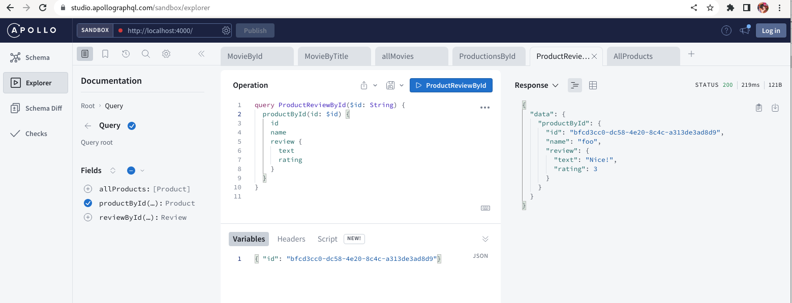

# quarkus-graphql-issue

Start the two subgraphs

Product

```bash
mvn clean quarkus:dev -Ddebug=5006 -pl product
curl http://localhost:8081/graphql/schema.graphql
```

Review

```bash
mvn clean quarkus:dev -Ddebug=5006 -pl review
curl http://localhost:8082/graphql/schema.graphql
```

Start Apollo Gateway for the federated graph

```bash
cd gateway
npm run start
```

Test

```bash
google-chrome --new-window http://localhost:4000/
```

```
query ProductReviewById($id: String) {
  productById(id: $id) {
    id
    name
    review {
      text
      rating
    }
  }
}

{ "id": "bfcd3cc0-dc58-4e20-8c4c-a313de3ad8d9"}
```

Notes: Apollo and MIME Types - does not suppport `application/graphql+json`, so have a hacked old version here

- https://github.com/apollographql/federation/pull/1767
- https://github.com/apollographql/apollo-server/pull/6295/files

The Product{id, name} are from Product subgraph, and the Product{review} from the Review Subgraph. 


